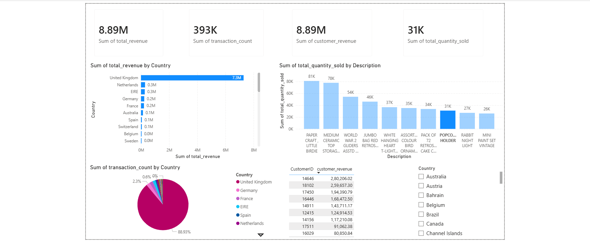

# Retail Data Engineering Pipeline using PySpark, SQL & Power BI

An end-to-end ETL and analytics pipeline built using PySpark for large-scale data processing, SQLite for analytics storage, and Power BI for business intelligence dashboards.

## Features
- Processed 500K+ retail transaction records
- Implemented layered ETL architecture (raw → processed → gold)
- Built Spark-based transformation workflows
- Generated SQL-driven business insights
- Created interactive Power BI analytics dashboard
- Added logging for pipeline monitoring

## Overview

This project demonstrates an end-to-end Data Engineering pipeline built using PySpark, SQL, SQLite, and Power BI.

The pipeline processes raw retail transaction data through multiple ETL stages to generate business insights and visual analytics dashboards.

---

## Tech Stack

- Python
- PySpark
- SQL
- SQLite
- Pandas
- Power BI
- AWS S3 Simulation
- Git & GitHub

---

## Project Architecture

```text
Raw Layer (Simulated AWS S3 Raw Bucket)
        ↓
PySpark ETL Transformation Pipeline
        ↓
Processed Layer (Cleaned Retail Data)
        ↓
Gold Layer Business Analytics
        ↓
SQLite Analytics Database
        ↓
Power BI Dashboard Visualization
```

---

## Project Workflow

### 1. Data Ingestion
- Loaded raw retail CSV dataset
- Stored dataset in raw data layer

### 2. Data Transformation
Using PySpark:
- Removed null values
- Filtered invalid records
- Created calculated columns
- Cleaned transactional data

### 3. Gold Layer Analytics
Generated:
- Country-wise revenue
- Top-selling products
- Top customers
- Transaction analytics

### 4. SQL Analytics Layer
- Loaded processed data into SQLite
- Executed business SQL queries

### 5. Dashboard Visualization
Created Power BI dashboard with:
- KPI cards
- Revenue analysis
- Product insights
- Customer insights
- Country transaction analysis

---

## Folder Structure

```text
retail-data-engineering-project/
│
├── aws_s3_simulation/
│   ├── raw_bucket/
│   ├── processed_bucket/
│   └── gold_bucket/
│
├── scripts/
│   ├── ingestion.py
│   ├── transformation.py
│   ├── gold_layer.py
│   └── load_to_sql.py
│
├── sql/
│   └── business_queries.sql
│
├── logs/
│   ├── transformation.log
│   └── gold_layer.log
│
├── screenshots/
│   └── dashboard.png
│
├── requirements.txt
├── README.md
└── .gitignore
```

---

## Dashboard Preview



---

## Key Business Insights

- United Kingdom generated the highest revenue
- Top-selling products were identified using sales quantity
- High-value customers were analyzed using total purchase amount
- Country-level transaction distribution was analyzed

---

## How to Run Project

### 1. Install Dependencies

```bash
pip install -r requirements.txt
```

### 2. Run Data Transformation Pipeline

```bash
py scripts/transformation.py
```

### 3. Run Gold Layer Analytics

```bash
py scripts/gold_layer.py
```

### 4. Load Data into SQLite

```bash
py scripts/load_to_sql.py
```

---

## Future Improvements

- Real AWS S3 integration
- Apache Airflow pipeline scheduling
- AWS Glue / Athena integration
- Parquet-based optimized storage
- Incremental ETL processing
- Real-time Spark Streaming pipeline
- Cloud deployment on AWS

---

## Resume Highlights

- Built end-to-end ETL data pipeline using PySpark
- Processed 500K+ retail transaction records
- Implemented layered data architecture (raw → processed → gold)
- Integrated SQL analytics and Power BI dashboarding
- Generated business insights using Spark transformations and SQL queries
- Implemented scalable Spark-based transformation workflows for large-volume retail transaction processing

---

## Scalability Considerations

- PySpark was used instead of Pandas for distributed-style large-scale data processing
- Layered architecture improves maintainability and pipeline organization
- Logging was implemented for monitoring ETL execution
- Simulated AWS S3 bucket structure mirrors enterprise cloud data lake architecture

## Pipeline Orchestration Design

The ETL pipeline was designed following a DAG-based orchestration approach inspired by Apache Airflow workflows.

Planned pipeline stages:

1. Data Ingestion Task
2. PySpark Transformation Task
3. Gold Layer Analytics Task
4. SQL Loading Task
5. Dashboard Refresh Task

This modular workflow design improves:
- pipeline maintainability
- task dependency management
- scalability
- scheduling capability
- monitoring and retry handling

Future implementation can integrate Apache Airflow for automated workflow scheduling and orchestration.